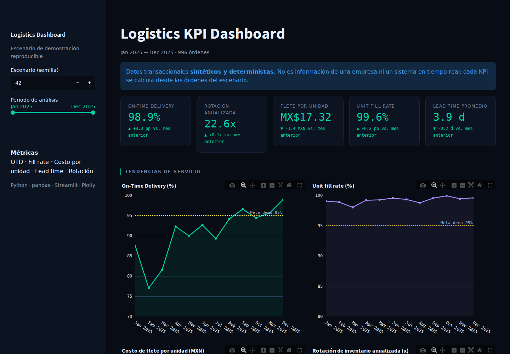

# Logistics KPI Dashboard

Interactive supply-chain analytics demo built with Python, pandas, Streamlit,
and Plotly. It turns reproducible **synthetic order rows** into auditable monthly,
supplier, and route KPIs.

> This is a portfolio simulation, not a production system, company dataset,
> real-time feed, SAP integration, or record of customer impact.

## What the project demonstrates

- Calculation of operational KPIs from order-level dates, quantities, costs,
  suppliers, and routes.
- One period filter applied consistently to monthly, supplier, and route views.
- Data-contract validation for duplicate keys, missing values, impossible dates,
  negative values, over-shipments, and invalid defect quantities.
- Reproducible business scenarios selected with a random seed.
- Stable CSV export of the full selected order cohort used by the monthly
  series plus supplier and route views; headline cards summarize its end month.
- Unit tests for known KPI results plus a Streamlit application smoke test.
- Automated linting and tests in GitHub Actions.

## Dashboard

The application shows five calculated KPIs, service and cost trends, supplier
performance, a route cost–service matrix, and two automatically generated
operational observations.



## KPI definitions

| KPI | Formula used in this demo | Unit |
|---|---|---|
| On-Time Delivery | Orders delivered on/before promised date ÷ delivered orders | % |
| Unit fill rate | Shipped units ÷ ordered units | % |
| Freight cost per unit | Total freight cost ÷ shipped units | MXN/unit |
| Lead time | Average of delivery date − order date | Days |
| Annualized inventory turnover | 12 × monthly COGS ÷ average monthly inventory | Times/year |

The 95% service targets are scenario references, not universal industry
standards. The bundled data intentionally contains late and partially fulfilled
orders so the dashboard has exceptions to analyze.

The period selector assigns each order to a month using `order_date`. OTD then
evaluates the completed delivery outcome for that order cohort; it is not grouped
by delivery month.

## Run locally

```bash
python -m venv .venv
source .venv/bin/activate          # Windows: .venv\Scripts\activate
python -m pip install -r requirements.txt -r requirements-dev.txt
streamlit run dashboard.py
```

Open `http://localhost:8501`, change the period or scenario seed, and verify that
all order-based views recalculate from the same selected rows while inventory
turnover uses the matching monthly inventory facts.

## Manager-ready operational task

Use the dashboard as a short evidence trail for a common request: **identify a
service or transportation exception and provide the supporting order rows**.

1. Select a scenario seed and analysis period; the cohort uses `order_date`.
2. Read the five headline cards as the **end-month snapshot** and use the trend,
   supplier, and route views to analyze the full selected range.
3. Download **filtered orders (CSV)**. The file contains every order in that
   selected range, matching the trend, supplier, and route cohorts.
4. To reconcile a headline card, first filter `order_date` to the end month. To
   reconcile route unit cost, calculate `sum(freight_cost_mxn) /
   sum(shipped_units)`; do not average the per-order unit-cost column.
5. Audit `on_time`, `unfilled_units`, and `lead_time_days` before recommending
   any operational action.

The export has one row per `order_id`, ISO dates, MXN costs, a stable column
order, and UTF-8 encoding. Its per-order freight ratio is useful for row-level
inspection, while dashboard route and monthly costs use the weighted aggregate
ratio of total freight to total shipped units. It remains synthetic evidence of
analysis behavior, not an extract from an employer or customer system.
Inventory turnover also uses the separate monthly inventory fact set, which is
intentionally not duplicated across order rows in this export.

## Verify

```bash
python -m ruff check .
python -m pytest -q -W error
```

The tests include a hand-calculated fixture: two January orders must produce 50%
OTD, 90% unit fill rate, MX$10 freight per shipped unit, six-day lead time, and
6x annualized inventory turnover. Export tests verify that filtering, row grain,
derived audit fields, column order, CSV serialization, and weighted route-cost
reconciliation remain stable.

## Project structure

```text
.
├── dashboard.py                 # Streamlit presentation
├── src/
│   ├── data.py                  # Deterministic order and inventory generation
│   ├── export.py                # Order-level export contract and serialization
│   ├── kpis.py                  # Period filtering and KPI aggregation
│   └── validation.py            # Input data contracts
├── tests/                       # Unit, validation, and AppTest smoke tests
├── docs/logistics-dashboard.png # Verified dashboard screenshot
├── .github/workflows/ci.yml     # Lint and test workflow
├── .streamlit/config.toml       # Stable local/deployed theme
├── requirements.txt
└── requirements-dev.txt
```

## Suggested interview walkthrough

1. Explain the difference between OTD and unit fill rate using their denominators.
2. Change the analysis period and show that supplier and route totals change with
   the monthly results.
3. Open `tests/test_kpis.py` and defend the expected values without running the
   dashboard.
4. Download the selected order cohort and reconcile one full-range chart
   observation—or filter to the end month before reconciling a headline card.
5. State which additional data would be needed before making a real operational
   decision.

## Change request and repair evidence

The repository keeps a public engineering trail rather than presenting only a
finished screenshot:

- [Issue #3](https://github.com/net421/logistics-dashboard/issues/3) records the
  manager-ready request for a traceable export of the filtered operational
  cohort and its verification criteria.
- [Issue #1](https://github.com/net421/logistics-dashboard/issues/1) records the
  original Plotly failure, invalid period behavior, missing screenshot, and
  unsupported claims.
- [Pull request #2](https://github.com/net421/logistics-dashboard/pull/2) shows the
  reviewed implementation that introduced coherent order rows, auditable KPIs,
  validation, tests, CI, and the verified screenshot now on `main`.

That issue-to-PR path demonstrates defect reproduction, scoped implementation,
automated verification, review, and documented limitations.

## Deployment status

No public deployment is claimed or configured. A Streamlit-compatible host must
use `dashboard.py` as the entry point, install `requirements.txt`, and start the
application with `streamlit run dashboard.py --server.headless true`. This start
command is smoke-tested locally; a public URL should be added here only after
that exact revision is deployed and manually verified.

## Limitations

- Synthetic, locally generated inputs only; no external database or scheduled
  refresh.
- All deliveries are completed; backorders are represented through partially
  shipped quantities rather than open-order lifecycle events.
- Currency and operating rules are fixed for this Mexican demo scenario.
- Results demonstrate reproducible analysis and application behavior, not
  professional production experience.

## Author

Emmanuel Beristain Guzmán · Logistics Engineer · Supply Chain Analytics<br>
[github.com/net421](https://github.com/net421)
